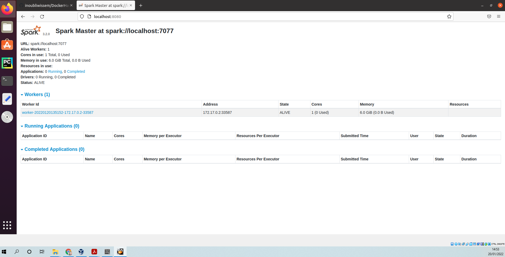
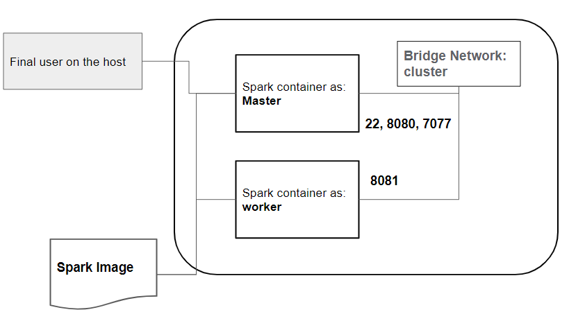
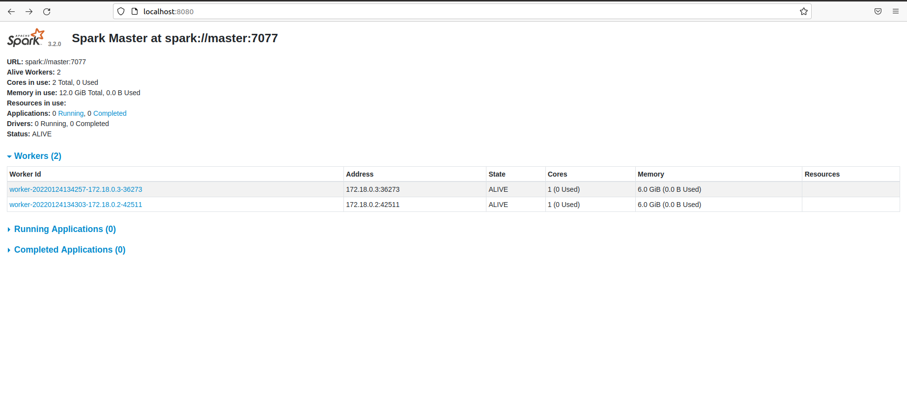

# Apache spark Single Node  on Docker.

Following this steps you can build and use the image to create a spark Single Node
## Build the image from the current Docker file
To run and create an from the docker file  execute the next command:  

      $ docker build -t **ImageName** . 
## Create the container

To run and create a container execute the next command:

     $ sudo docker run -it --name <container-name> -p 7077:7077 -p 8080:8080 --hostname <your-hostname> hadoop bash

Change **container-name** by your favorite name and set **your-hostname** with by your ip or name machine.

You should get the following prompt:  

       spark@localhost:~$ 
Start the ssh server:  

     spark@localhost:~$ sudo service ssh start 
     

Start the spark services (master and workers):  

     spark@localhost:~$ ./spark/sbin/start-all.sh 

Check if all services are started :  

    spark@localhost:~$ jps   
    352 Jps   
    320 Worker   
    263 Master  
  Check if all services are started using the Spark GUI :
  

## Deploy a Spark cluster using the current docker image   
The next architecture shows the configuration using docker
 

  In this architecture we have:
  *  Spark Image
  *  two containers (master and worker) from the spark image
  *  A local virtual network (cluster)
## Create the virtual network

        :~$ create --driver bridge cluster   
## Create the containers (master, worker1)

        :~$ sudo docker run -it --name master -p 7077:7077 -p 8080:8080 --hostname master --network cluster spark bash    
        :~$ sudo docker run -it --name master -p  -p 8081:8081 --hostname worker1 --network cluster spark bash  
## Edit the config. file in both containers (master, worker1):
     spark@master:~$ cp /home/spark/spark/conf/workers.temlate  /home/spark/spark/conf/workers
     spark@master:~$ cat master >>  /home/spark/spark/conf/workers   
     spark@master:~$ cat worker1 >>  /home/spark/spark/conf/workers  
     spark@master:~$ cp /home/spark/spark/conf/spark-defaults.conf.template /home/spark/spark/conf/spark-defaults.conf  
     spark@master:~$ cat "spark.master    spark://master:7077 >>  /home/spark/spark/conf/spark-defaults.conf  
     spark@master:~$ scp  /home/spark/spark/conf/spark-defaults.conf spark@worker1:/home/spark/spark/conf/  
     spark@master:~$ scp  /home/spark/spark/conf/workers spark@worker1:/home/spark/spark/conf/  
     spark@master:~$ ./spark/sbin/start-all.sh  
     
   ## The deployed cluster  
The next figure shows the started cluster:
 

